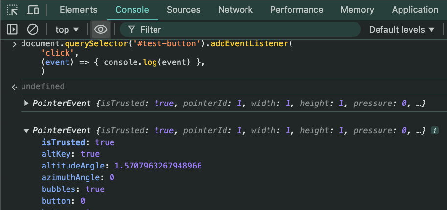

# Intro to JS
- It's been around since 1995, but after Java.
- It was initially names LiveScript but was later renamed JavaScript to leverage the popularity of Java at the time.
- JavaScript is called also ECMAScript.
- JavaScript is ridiculously liberal in what it allows. (Watch this [YT video](https://youtu.be/J6yiNbiiCzA?si=2CmQUkP9WykEi08B)for more details how JS is normal language)
- So many same but not similar and similar but not same syntax and meanings in JS :-(
    - **strings** can be surrounded by `"`, `'` or `` ` `` . The back tick character (`` ` ``) is to be used when *newlines* characters need to be inserted.
    - unary operators, e.g:
      ```JS
      console.log(typeof 4.5)
      // → number
      console.log(typeof "x")
      // → string
      ```
    - special numbers and values and behaviour
      - `NaN`, `Infinity`, `null`, and `undefined`
        ```JS
        console.log(NaN == NaN)
        // → false
        console.log(null == undefined);
        // → true
        console.log(null == 0);
        // → false
        console.log(Infinity + 1 == Infinity + 3)
        // → true
        ```
    - weird variables declaration
      - `var x` – the old way
      - `let x` - the new/current way
      - `constant x` – same as `var x` and `let x`<br>
        No true constant as someone would think!
    - semicolon (`;`) use is only for decorative purposes.
    - hanging commas (`,`) in the object definition is fine :-(
      ```JS
      const person = {
        name: 'Navita',
        age: '28',
        eyeColor: 'brown',
      }
      ```
## Into to the DOM
The DOM – **Document Object Model** - is the way through which JS interacts with content within a website.
It's a "tree" of objects, with JS objects representing the head, body, title, paragraphs, etc.
At the head of this tree-the great-great-great-grandparent of all the rest, so to speak - the original ancestor - is the `window` object, and inside the window object is the `document` object, which represents our page.
In a browser's DevTools > Console, type: `document.` and see a long list of properties, methods and objects that are "children" of the `document` object.

### Accessing HTML elements
- by **tag name** (elements like `p` or `div`)
- by **class name** (class attribute, e.g. `class="container"`)
- by **id** (id attribute, e.g. `id="logo")

**IDs** are preferred way for JS to access HTML elements and should not be used much by CSS.
CSS should generally use **classes**.
But it all depends if you want access and manipulate single or multiple elements at once.

To access elements we use the[`document.querySelector()`](https://developer.mozilla.org/en-US/docs/Web/API/Document/querySelector) or [`document.querySelectorAll()`](https://developer.mozilla.org/en-US/docs/Web/API/Document/querySelectorAll) methods
- `document.querySelector('h1')` - returns 1st available single element.
- `document.querySelectorAll('p')` - returns all matching elements as a `NodeList`.
- `document.querySelector('#w3schools-tutorial')` -returns an enclosed element of the given ID
- `document.querySelector('a#w3schools-tutorial')`, we can also ask for the element with the given ID and result should be same.
- `document.querySelectorAll('.container')` - returns a list of all elements with the `container` class.
### Modifying HTML elements
- `innerHTML` attribute will update the value on it, e.g. `document.querySelector('.dom').innerHTML = "HTML5 Document Object Model"` will set the text (in this instance) in the 1st occurrence of the class `.dom` on the 1st element.
  - as the `.dom` class is associated only with:
`<span class="dom">HTML DOM</span>`, but in reality it converts entire tree from the selector position as a plan text/string representation
- to update multiple occurrences, we need to use `querySelectorAll)` method and iterate over a returned `NodeList` using `for` loop technique:
  ```JS
  const spans = document.querySelectorAll('.dom')
  for (let i = 0; i < spans.length; i++) {
    spans[i].innerHTML = 'HTML5 Document Object Model'
  }
  ```
### The DOM & Events
Users interact with webpages by using mouse and keyboard (resizing windows, clicking on it, right clicking, ...). Those occurrences are events and the most frequent ones are ,e.g.:
- `click`
- `mouseenter`
- `keyup`
- [etc](https://developer.mozilla.org/en-US/docs/Web/Events)

Events are handled by attaching an "event handler" to the object we want to keep track of and providing that handler with a "callback" function that we want it to use when the event occurs.

So, essentially, we can write some code which says to the browser, "*When the user clicks on this button, we want you to call this function and give it an 'event object' with lots of information about the event that occurred.*"

#### Making an Event Handler
using `.addEventListener()` method. We'll pass it a function to call when the button is clicked, e.g.
```JS
document.querySelector('#test-button').addEventListener(
  'click',
  (event) => { console.log(event) },
  )
```

There's a lot of stuff in the `event` object, e.g. `event.target`, which is the button element itself =>
`<button id="test-button">Click Me!</button>`
- we can now change it, e.g. make the button text change when **click** on it:
- `(event) => { event.target.innerHTML = "Boom!},)`
- we can change more stuff:
```JS
document.querySelector('#test-button').addEventListener(
    'click',
    (event) => {
        console.log("before " + event.target.innerHTML)
        event.target.innerHTML = event.target.innerHTML == "Click Me!" ? "Boom!" : "Click Me!"
        console.log("after " + event.target.innerHTML)

        heading = document.querySelector('h1').innerHTML
        console.log("before: " + heading)
        document.querySelector('h1').innerHTML = heading == "My test page" ? "I'm a new heading" : "My test page"
        console.log("after: " + document.querySelector('h1').innerHTML)
    },
```
- **keystroke events** – we can capture the stroke
  - on the way down `keydown`
  - on the way up `keyup`
  - or both `keypress`
  ```JS
  let input = document.querySelector("#keystroker")
  let output = document.querySelector("#outputter")

  function updater (event) { output.innerHTML = input.value }
  input.addEventListener("keyup", updater)
  ```

### The DOM & Form Submission
We can prevent default actions on submitting a form. This would helps us:
```JS
let form = document.querySelector("#catch-it")
let input = document.querySelector("#some-text")
let output = document.querySelector("#outputter")

function updater (e) {
    e.preventDefault()
        output.innerHTML = 'Submitting form with "' + input.value + '"'
}

form.addEventListener('submit', updater)
```
Refer to the training [HTML document](https://github.com/delphym/devAcademy-workshop/blob/Sprint3/domLesson.html) at my other repo (and pay attention to the commit messages in *'Sprint3'* branch).

## Manipulating the DOM
### Event listener mechanisms
- Use `addEventListener()` to register event handlers - the best way to use these days
  - can scale up with more complex programs
    ```JS
    element.addEventListener("click", function1);
    element.addEventListener("click", function2);
    ```
- Event handler **properties** - easy to use, but has limitations
  - can't add more than one handler for a single event
    ```JS
    element.onclick = function1;
    element.onclick = function2;
    ```
  - bizarre JS behaviour for associating JS function with an event
    `document.getElementById("customerButton").onclick = generateCustomerOrder()` – The brackets after the function name will will cause an instant execution of the function! To prevent this, the code needs to look like this:
    `document.getElementById("customerButton").onclick = generateCustomerOrder`
- Inline event handlers — don't use these
  ```JS
  <button onclick="alert('Hello, this is my old-fashioned event handler!');">
    Press me
  </button>
  ```